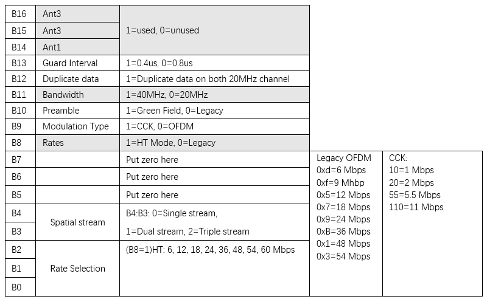
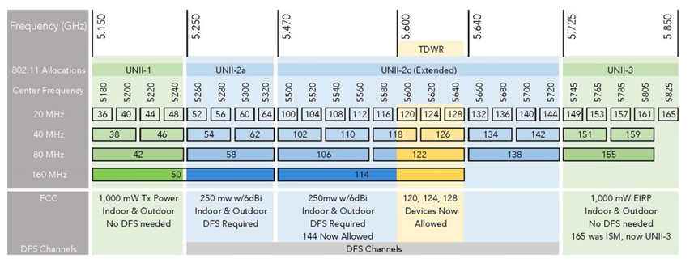

# linux-80211n-csitool-supplementary修改版

## Github

- [linux-80211n-csitool](https://github.com/dhalperi/linux-80211n-csitool)
- [linux-80211n-csitool-supplementary](https://github.com/dhalperi/linux-80211n-csitool)

## How to install

You need LORCON version 1 to compile this executable.

- install libpcap-dev
- download LORCONv1 from <http://802.11ninja.net/svn/lorcon/branch/lorcon-old/>, or the mirror <https://github.com/dhalperi/lorcon-old.git>
- compile and sudo make install LORCON
- make install here

## How to use

- receiver:

```bash
setup_monitor_csi.sh 64 HT40-
sudo log_to_file log.dat
```

- transmitter:

```bash
setup_inject.sh 64 HT40-
sudo random_packets 1000 100 1 500
```
`Usage: random_packets <number> <length> <mode: 0=my MAC, 1=injection MAC> <delay in us>`

Please check the source code for random_packets.c to understand the meaning of these parameters and the other parameters that are available.

## Rate and channel

- The rates shown above are 32-bit values in the rate_n_flags format [described in the source code](https://github.com/dhalperi/linux-80211n-csitool/blob/csitool-3.13/drivers/net/wireless/iwlwifi/dvm/commands.h#L245-L334).



- 5 GHz channel allocation



